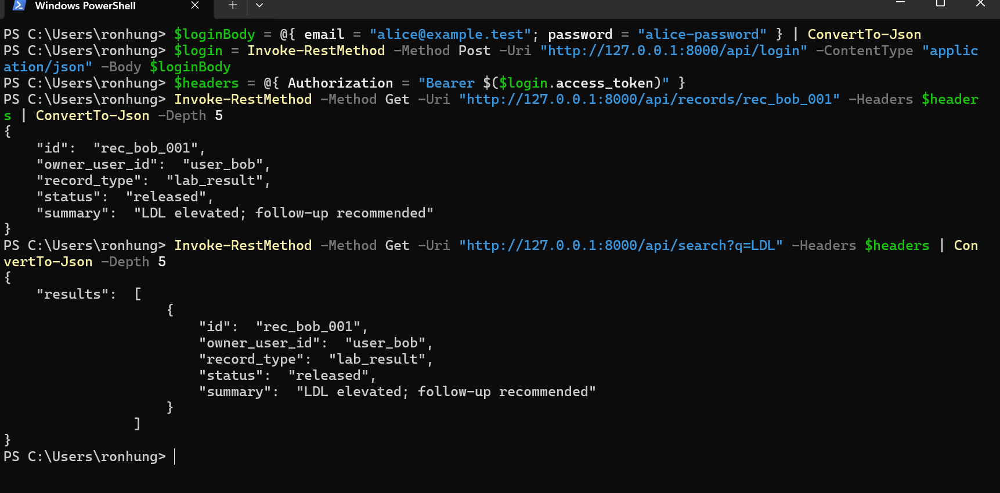
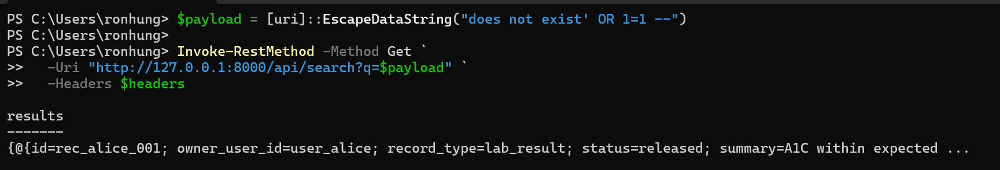
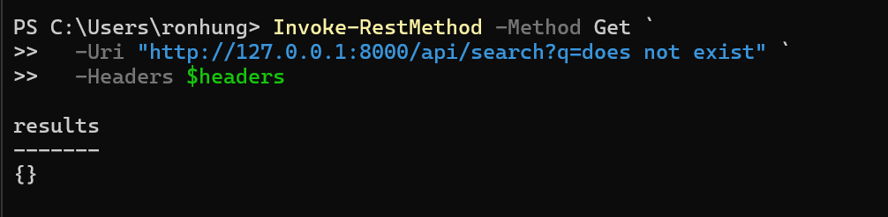

# Triage Report

The Semgrep scan results had 5 blocking issues, 3 criticals, 1 error, and 1 high that were:

```
CRITICAL HIGH app/routes/records.py:27 fastapi-record-read-without-owner-check
CRITICAL HIGH app/routes/records.py:39 fastapi-record-read-without-owner-check
CRITICAL HIGH app/routes/search.py:17 fastapi-record-read-without-owner-check
ERROR    HIGH app/auth.py:26 python.jwt.security.jwt-hardcode.jwt-python-hardcoded-secret
HIGH     HIGH app/db.py:76 sqlite-query-built-with-f-string
```

1. For the 3 critical issues that relate to improper authorization, we can see in the code that there is no user/role check to validate the logged-in user which means a malicious user can attempt to retrieve records and search of any other patient. Since this is a simple application that we can run locally we can validate this by logging in as Alice and attempting to get the record of Bob as seen here:


2. For the error issue that relates to a harcode coded secret, we see that the secret is directly stored in plaintext at line 26. The value itself says it's local and for demo use only, which we can ask for additional verification from the engineering team if this secret is scoped to local environment and not production, but we would also want team's to follow best practices and either store secrets in a secrets manager via a cloud provider or within Github Secrets.

3. For the high issue, we see that SQL query is built with an f-string that takes in term as a query string parameter from the API. String parameters are the largest attack vector for SQL injections because they can contain malicious SQL statements if not sanitized properly. We can again test this out by hitting this API with a 1=1 SQL statement that will always return true:


This shows that we were able to bypass the query and return every record. Versus the base case where a query that shouldn't return any results without a malicious SQL statement, would return an empty result object:
